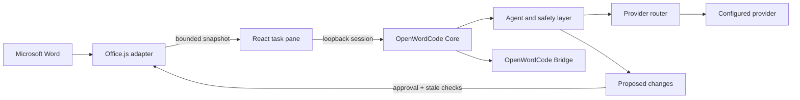

# OpenWordCode

OpenWordCode is an open-source AI document agent for Microsoft Word. It runs a
local TypeScript Core beside a React task pane, reads the Word context needed
for a request, and turns document changes into reviewable, tracked edits.

**Creator and maintainer:** Liko  
**License:** MIT  
**Status:** early public development (`0.1.x`)

OpenWordCode is an independent project. It does not require the sibling
OpenCodex project, another application's proxy, browser cookies, or credential
files.

## What it can do

- Chat with an AI agent without leaving Word.
- Read the current selection, nearby context, paragraphs, outline, tables, and
  other host capabilities exposed by Word.
- Review, rewrite, summarize, draft, format, and propose document changes.
- Apply approved edits through the Office adapter with stale-target checks and
  tracked-change-friendly behavior.
- Attach images and PDFs for providers that support multimodal input.
- Use provider API keys, local models, the OpenWordCode Bridge, or supported
  provider-specific OAuth flows.
- Search the web when enabled and inspect a bounded local workspace through the
  read-only console tool.
- Keep provider credentials in the local Core credential store instead of the
  Word task pane.

The project does not promise that every preview member of `Word.Range` works on
every Word build. Office.js capabilities are checked at runtime and unsupported
operations fail clearly instead of being silently faked.

## Requirements

For the real add-in workflow:

- Windows 10 or Windows 11.
- Microsoft Word Desktop with Office Add-ins enabled.
- Node.js 20 or newer and npm.
- An API key, local model, or supported account connection for the provider you
  choose.

The browser preview and automated tests can run without Microsoft Word, but
they use the in-memory Word adapter and cannot validate a live document.

## Quick start

From a fresh checkout:

```powershell
git clone https://github.com/YOUR_GITHUB_USERNAME/OpenWordCode.git
cd OpenWordCode
npm ci
Copy-Item .env.example .env
npm run cert:install
npm run dev
```

Replace `YOUR_GITHUB_USERNAME` with the repository owner's account. The
development processes listen on:

- Core: `http://127.0.0.1:10200`
- Word task pane: `https://localhost:3000`
- OpenWordCode Bridge: `http://127.0.0.1:10101`

Open `https://localhost:3000` once in a browser and trust the local development
certificate if your browser asks. Leave `npm run dev` running while testing.

The default provider is OpenAI and expects the user's own API key. You can
connect it in the task pane or set `OPENAI_API_KEY` in your local `.env`. The
Core stores an in-app key in its local encrypted credential store; it is not
returned to the browser UI.

## Sideload into Word Desktop

The local development manifest is not installed through the public Office
Store. Use Word's desktop sideload/debug registration:

1. Close Word completely.
2. Start the project with `npm run dev`.
3. In a second terminal, run `npm run sideload`.
4. Open Word and choose **Home → Add-ins → OpenWordCode**.
5. Confirm the task pane can reach the local Core.
6. When finished, close Word and run `npm run unsideload`.

If an old registration is stuck, close Office and run:

```powershell
npx office-addin-cache clear
```

Then repeat the sideload steps. On a new Windows user, run
`npm run cert:install` once and restart the Vite server.

## Configuration and authentication

Copy `.env.example` to `.env` only for local development. The file is ignored
by Git. Never place real credentials in source, screenshots, issues, tests, or
pull requests.

### API keys and local models

The built-in providers include OpenAI, Anthropic, OpenRouter, Google Gemini,
xAI, Kimi Code, Nous, Ollama, LM Studio, and the offline demo provider. API
keys can be entered in the task pane or supplied through the matching
environment variable. Ollama, LM Studio, and Demo do not require credentials.

### OAuth

The current provider-specific OAuth adapters are experimental and include
Claude, xAI, Kimi Code, Google Antigravity, GitHub Copilot, and Nous Portal.
OAuth is started in the user's browser; the task pane never asks for the
provider password and tokens remain in the local Core credential store.

The OpenWordCode account/Bridge sign-in requires an OAuth client registration
owned by the OpenWordCode deployment. Set
`OPENWORDCODE_OPENAI_OAUTH_CLIENT_ID` only after registering that client and
adding the localhost callback. Google Antigravity sign-in also requires a
provider-approved `GOOGLE_ANTIGRAVITY_CLIENT_SECRET` in the Core environment.
Neither value belongs in GitHub.

Cursor, Kiro, and Command Code are intentionally not enabled as generic bearer
token providers. Their account sessions require provider-specific transports;
pretending otherwise would produce a login screen that cannot reliably work.

See [`docs/AUTHENTICATION.md`](docs/AUTHENTICATION.md) for the full matrix and
credential lifecycle.

## How it works



The Core owns authentication, credential resolution, provider routing, model
discovery, the agent loop, streaming, web search, bounded console actions, and
change state. Office.js stays inside `packages/app-word`; the model never
receives an Office.js object or arbitrary write capability.

Document edits follow this path:

1. The agent creates a validated proposal containing the target fingerprint and
   original text.
2. The task pane shows the proposal and asks for approval according to the
   selected mode.
3. Core and the Word adapter re-read the live target.
4. A stale or changed target fails closed.
5. The adapter applies the edit and the task pane records the result.

## Safety and privacy

- Core and Bridge bind to loopback by default.
- Protected routes use a process session token; mutations also require CSRF
  protection.
- Credentials are kept out of the task pane and are encrypted locally by the
  Core credential store.
- Cloud providers receive the bounded document context and attachments needed
  for the request. Review each provider's terms before sending sensitive files.
- The console tool is read-only and bounded to workspace inspection in this
  development line; it is not an unrestricted Windows command shell.
- `Skip all approvals` is intentionally unsafe for untrusted documents or
  prompts. Manual approval is the default.
- OpenWordCode does not persist document text or uploaded attachments in the
  current `0.1.x` Core; active request data is held in memory.

Read [`SECURITY.md`](SECURITY.md) and [`docs/PRIVACY.md`](docs/PRIVACY.md)
before exposing the project to other users.

## Commands

| Command | Purpose |
| --- | --- |
| `npm run dev` | Start Core and the HTTPS task pane together |
| `npm run start` | Start the Core and local Bridge |
| `npm run status` | Check Core status |
| `npm run doctor` | Run local environment diagnostics |
| `npm run providers` | List configured providers |
| `npm run models` | List discoverable models |
| `npm run cert:install` | Install the Office development certificate |
| `npm run cert:verify` | Verify the development certificate |
| `npm run sideload` | Register the manifest in Word Desktop |
| `npm run unsideload` | Remove the local Word registration |
| `npm run typecheck` | Run TypeScript checks |
| `npm test` | Run the automated test suite |
| `npm run build` | Build the task pane |

## Repository layout

```text
OpenWordCode/
├── apps/
│   ├── core/                 # Fastify local Core, auth, Bridge, and CLI
│   └── word-addin/           # React/Vite task pane and Office manifest
├── packages/
│   ├── agent-core/           # Prompts, bounded tools, and agent loop
│   ├── app-word/             # Office.js and in-memory Word adapters
│   ├── auth/                 # Local credential-store abstraction
│   ├── providers/            # Provider adapters and model discovery
│   ├── security/             # Redaction, tokens, and loopback checks
│   └── shared/               # Cross-boundary protocol types
├── docs/                     # Architecture, auth, privacy, and testing notes
├── skills/docx/              # Document-domain guidance loaded by the agent
└── tests/                    # Core, provider, agent, and adapter tests
```

## Development

```powershell
npm ci
npm run typecheck
npm test
npm run build
```

Read [`CONTRIBUTING.md`](CONTRIBUTING.md) before opening a pull request. The
GitHub Actions workflow runs the same typecheck, test, and build gates on every
push and pull request.

## Known limitations

- Live Word Desktop and every Office.js host/API set are not available in CI.
- Some `Word.Range` members are preview-only or unavailable in installed Word
  builds and will report a clear unsupported-operation error.
- Provider OAuth is provider-specific, experimental, and subject to provider
  authorization, plan, and terms changes.
- The fallback encrypted credential backend should be replaced with a native
  OS credential backend before a packaged enterprise distribution.
- This repository does not include a hosted backend, billing system, or public
  OAuth client registration.

## Credits, license, and trademarks

OpenWordCode was created and is currently maintained by **Liko**. See
[`ATTRIBUTIONS.md`](ATTRIBUTIONS.md) for project credits and third-party
notices. The source is available under the [MIT License](LICENSE).

Microsoft Word, Office.js, OpenAI, Claude, Gemini, Grok, Kimi, GitHub Copilot,
and other product names belong to their respective owners. OpenWordCode is not
affiliated with or endorsed by those organizations.
